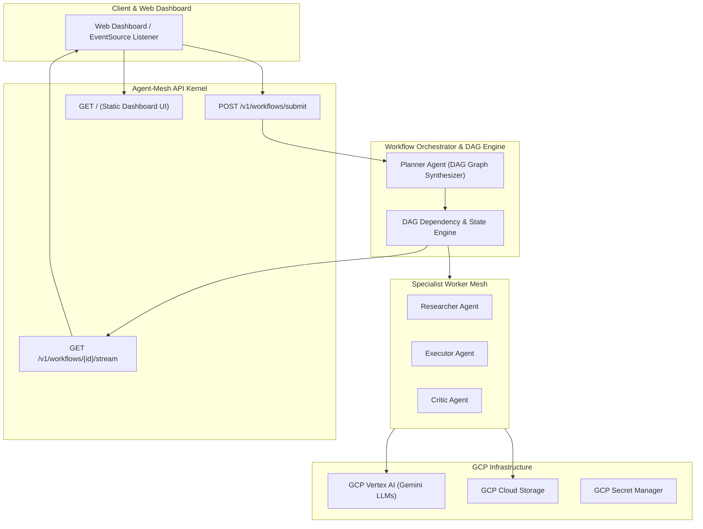

# Agent Mesh (`agent-mesh`)

[](file:///Users/dalehendriques/Downloads/MELVIN_WORK/carassco-labs/handbook/README.md)
[](https://github.com/melvincarassco/gcp-foundation)
[](https://fastapi.tiangolo.com/)
[](https://cloud.google.com/vertex-ai)
[](https://developer.mozilla.org/en-US/docs/Web/API/Server-sent_events)

> **Autonomous Multi-Agent AI Orchestrator & Event-Driven DAG Execution Engine**

---

## 📌 What is Agent Mesh?

`agent-mesh` is a high-performance, real-engineering AI systems orchestrator built on top of `gcp-foundation`. 

Moving beyond traditional CRUD web applications, `agent-mesh` implements a **distributed multi-agent execution pipeline**:
- **DAG Task Dependency Engine**: Topological graph sorting (Kahn's Algorithm), parallel task dispatch, and fault-tolerant retry loops.
- **Multi-Agent Specialist Mesh**:
  - 🧠 **Planner Agent**: Decomposes high-level goals into dependency-managed DAG execution trees.
  - 🔍 **Researcher Agent**: Gathers context from Cloud Storage, Vector Search, and web APIs.
  - ⚡ **Executor Agent**: Performs analytical calculations, code execution, and data transformations.
  - ⚖️ **Critic Agent**: Evaluates output accuracy against strict quality constraints.
- **Real-Time SSE Event Telemetry**: Streams live agent thought steps, state transitions, and execution results over Server-Sent Events (`GET /v1/workflows/{id}/stream`).
- **Interactive Web Telemetry Dashboard**: Modern glassmorphism UI for goal submission, real-time DAG node visualization, and live event log streaming.

---

## 🏗️ System Architecture



---

## 🤖 Specialist Multi-Agent Matrix

| Agent Role | Primary Responsibility | Input Contract | Output Contract | Model Target |
| :--- | :--- | :--- | :--- | :--- |
| 🧠 **Planner Agent** | Task Graph Decomposition | High-Level User Objective (`str`) | `DAGGraph` (Tasks & Dependencies) | Gemini 1.5 Flash |
| 🔍 **Researcher Agent** | Context & Knowledge Retrieval | Task Description + Inputs | Key Findings & Sources (`dict`) | Gemini 1.5 Flash |
| ⚡ **Executor Agent** | Computational & Analytical Synthesis | Task Specs + Prerequisite Data | Synthesized Output Payload (`dict`) | Gemini 1.5 Flash / Pro |
| ⚖️ **Critic Agent** | Quality & Constraint Verification | Output Payload + Criteria | Verification Score & Notes | Gemini 1.5 Flash |

---

## 🔌 API Endpoints Reference

| Method | Endpoint | Description |
| :--- | :--- | :--- |
| **GET** | `/` | **Interactive Web Telemetry & DAG Dashboard UI**. |
| **POST** | `/v1/workflows/submit` | Submits a high-level goal, invokes Planner Agent, and initializes DAG dependency graph. |
| **GET** | `/v1/workflows/{workflow_id}` | Retrieves current workflow status and DAG task graph state. |
| **GET** | `/v1/workflows/{workflow_id}/stream` | **Server-Sent Events (SSE)** stream broadcasting live agent thought events and task outputs. |
| **GET** | `/health` | Liveness probe returning container process status. |
| **GET** | `/ready` | Readiness probe returning system dependency readiness. |

---

## ⚡ Quick Start for Developers

### 1. Local Environment Setup
```bash
# Clone the repository
git clone https://github.com/melvincarassco/agent-mesh.git
cd agent-mesh

# Setup python environment
python3 -m venv .venv
source .venv/bin/activate
pip install -r app/requirements.txt
```

### 2. Run Test Suite
```bash
PYTHONPATH=. .venv/bin/python -m pytest --cov=app tests/
```

### 3. Launch Application & Web Dashboard
```bash
PYTHONPATH=. .venv/bin/uvicorn app.main:app --port 8080 --reload
```
Open **`http://localhost:8080`** in your browser to launch the Web Telemetry Dashboard!

---

## 🧪 cURL API Testing & Live Event Streaming

### Submit a Goal
```bash
curl -X POST http://localhost:8080/v1/workflows/submit \
  -H "Content-Type: application/json" \
  -d '{"goal": "Research serverless AI trends and write an architecture document"}'
```

Response:
```json
{
  "workflow_id": "wf-a1b2c3d4",
  "status": "INITIALIZED",
  "goal": "Research serverless AI trends and write an architecture document"
}
```

### Stream Live Events (SSE)
```bash
curl -N http://localhost:8080/v1/workflows/wf-a1b2c3d4/stream
```

---

## 📜 License & Governance

Managed under the **Carassco Labs Engineering Governance Framework**. Inherits baseline cloud infrastructure from [`gcp-foundation`](https://github.com/melvincarassco/gcp-foundation).
