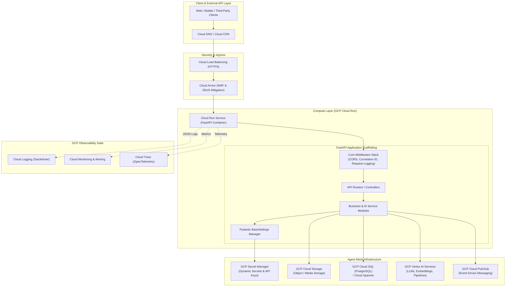
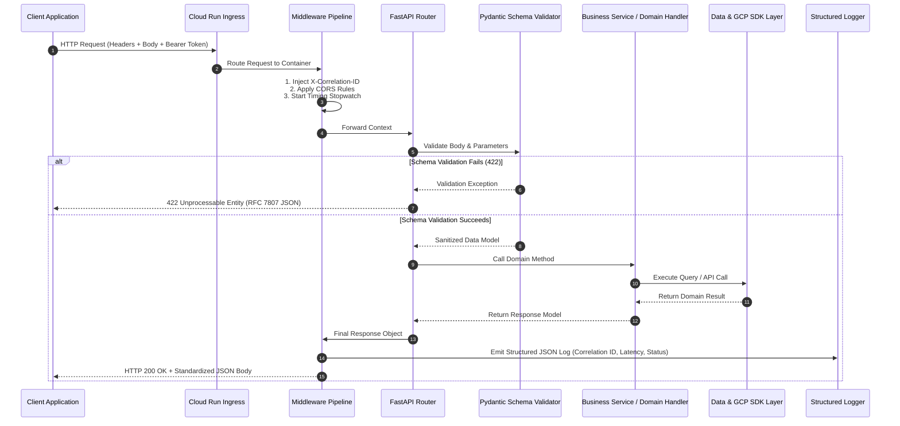
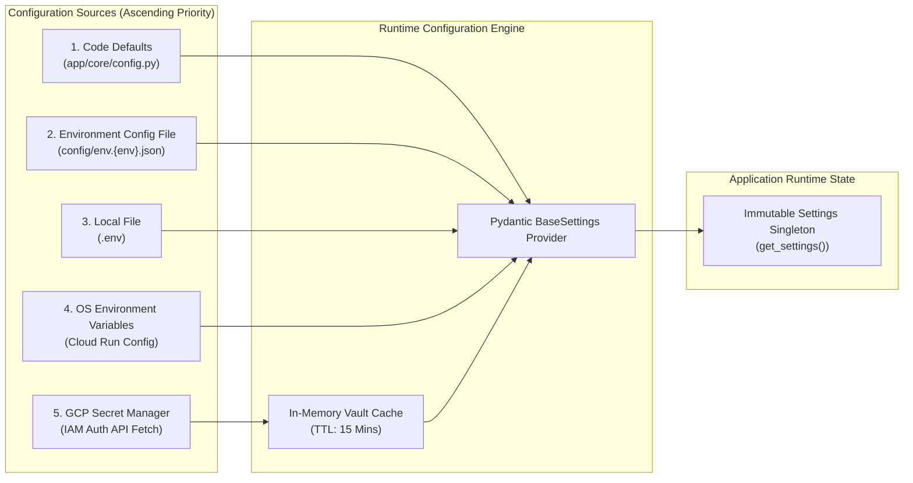
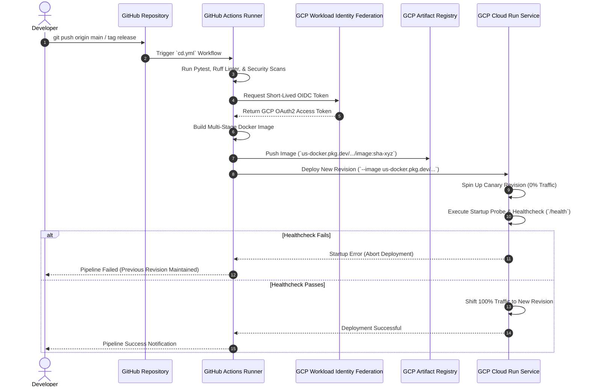
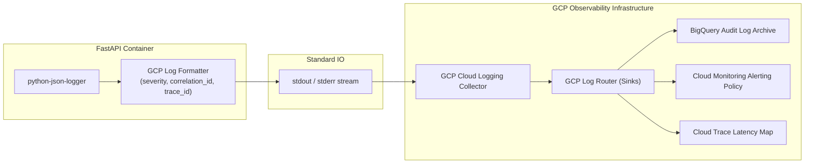
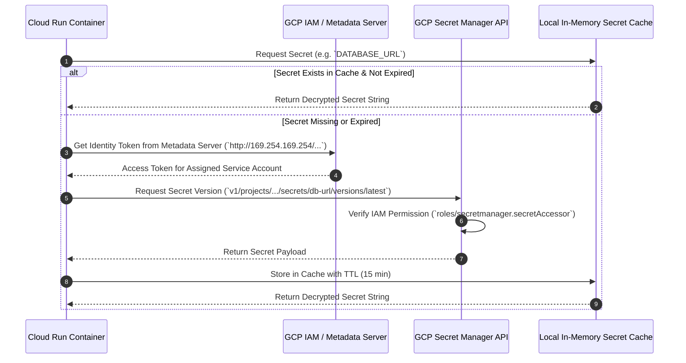
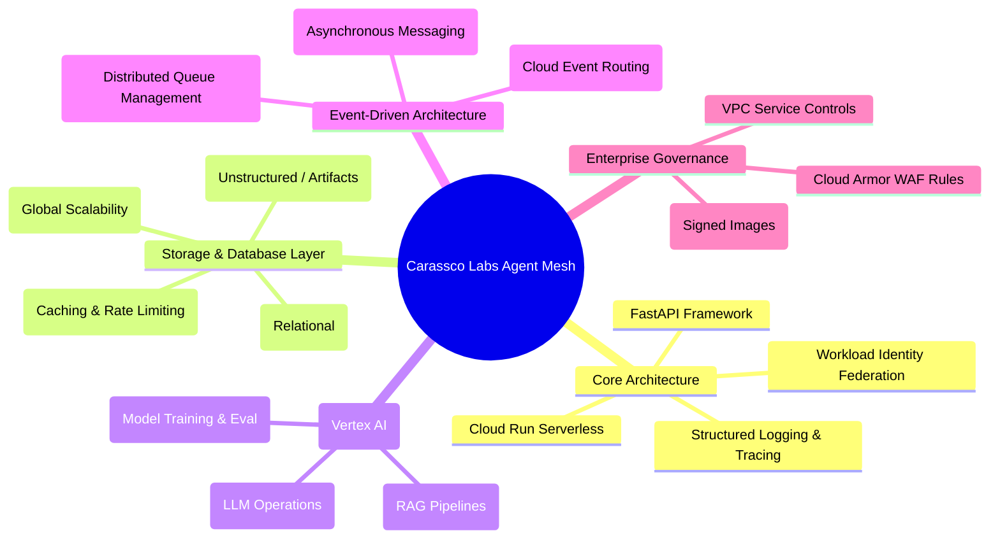

# System Architecture: Agent Mesh

This document defines the high-level architecture, component interaction, security boundaries, and GCP cloud-native flows for `agent-mesh`—the baseline backend template for Carassco Labs applications.

---

## 1. High-Level System Architecture

The foundation relies on a serverless, containerized web service model powered by **Google Cloud Run**, integrated with managed GCP enterprise infrastructure.

---

## 2. Request Lifecycle Architecture

Every HTTP/gRPC request flows through strict middleware validation, correlation ID injection, Pydantic type safety, and structured error handling.

---

## 3. Configuration & Secrets Hierarchy

Configuration resolution follows a strict priority order, securing runtime values and preventing credential leakage.

---

## 4. CI/CD Deployment Flow

Deployments use GitHub Actions with Workload Identity Federation (Keyless IAM Authentication) for zero-trust container publishing and Cloud Run deployment.

---

## 5. Logging & Observability Architecture

Structured logging ensures zero log truncation, full trace propagation, and automated GCP Cloud Logging parsing.

---

## 6. Secrets Management Flow

Secrets are never stored in code, Git, or static container environment variables. They are resolved via GCP IAM Service Accounts.

---

## 7. Future GCP Integration Roadmap

The foundation is designed to seamlessly integrate advanced GCP AI and data services in upcoming sprints:

